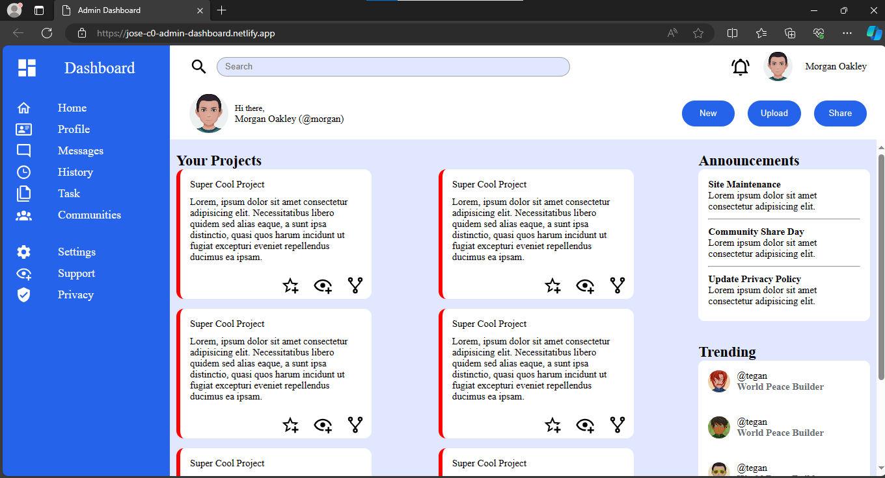

# About Project

#### TODO  
- [x] Crear un repositorio nuevo en GitHub.  
- [x] Agregar un archivo simple (puede ser un index.html o un script sencillo).  
- [x] Configurar un pipeline de CI/CD utilizando GitHub Actions que ejecute al menos un paso automatizado (lint, test o deploy a GitHub Pages).  
- [x] Realizar un commit y verificar que el pipeline se ejecute correctamente y finalice en estado exitoso (verde).  

## Stack  

- HTML5.  
- JavaScript.  
- CSS3 grid y flex para alinear elementos.  

### Preview

### Live:

https://jose-c0.github.io/mi-primer-pipeline/
 
